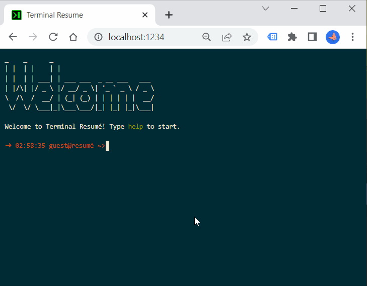

# terminal-resume

Turn your resume into a terminal-based website.

## Features

* Supports valid resume in [JSON resume format](https://jsonresume.org/)
* Customizable commands and sections
* Auto-complete, other terminal features from [JQuery Terminal](https://terminal.jcubic.pl/)
* Implement your own commands to flex your programming skills

## Building Locally

`npm run dev`

## Packaging

`npm run zip`  
Zips production ready package to be deployed.

## Customization 

- To map different sections to different commands, checkout `SectionCommands` in [config.ts](js/config.ts)
- To change color, look into [custom.css](css/custom.css) and `FontStyle` in [config.ts](js/config.ts)
- Want to add your own commands? checkout `customCommands` in [main.ts](js/main.ts) and [JQuery Terminal Docs](https://terminal.jcubic.pl/)

## License

[MIT](https://choosealicense.com/licenses/mit/)